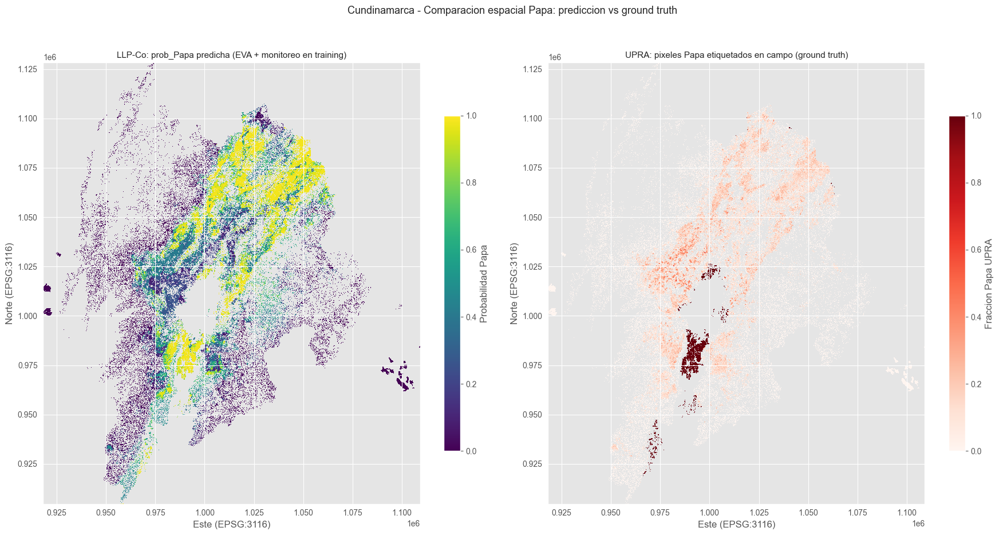
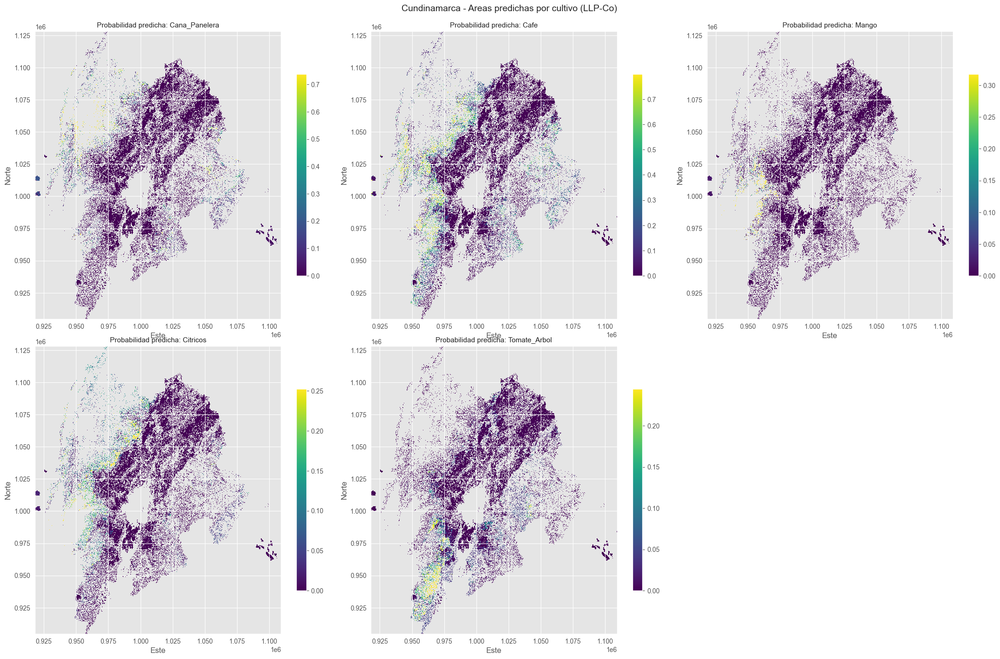

# ¿Qué Sembrar? — Sistema de Recomendación de Cultivos para Cundinamarca

> Plataforma de planificación agrícola basada en inteligencia artificial que recibe un polígono geográfico (la parcela del agricultor) y devuelve un ranking de cultivos ordenados por probabilidad de éxito, fundamentado en la aptitud agroecológica real de esa ubicación específica.

---

## Tabla de Contenido

1. [Resumen del Proyecto](#1-resumen-del-proyecto)
2. [Problema que Resuelve](#2-problema-que-resuelve)
3. [Fuentes de Datos](#3-fuentes-de-datos)
4. [Vista Minable](#4-vista-minable)
5. [Arquitectura de Modelos](#5-arquitectura-de-modelos)
6. [Modelo L1 — Papa (XGBoost)](#6-modelo-l1--papa-xgboost)
7. [Modelo L2 — LLP-Co (18 cultivos)](#7-modelo-l2--llp-co-18-cultivos)
8. [Resultados y Visualizaciones](#8-resultados-y-visualizaciones)
9. [Estructura del Repositorio](#9-estructura-del-repositorio)
10. [Instalación y Uso](#10-instalación-y-uso)
11. [Roadmap](#11-roadmap)
12. [Referencias](#12-referencias)
13. [Licencia y Créditos](#13-licencia-y-créditos)

---

## 1. Resumen del Proyecto

**¿Qué Sembrar?** es un módulo de inteligencia artificial para la planificación agrícola en Cundinamarca, Colombia. Integra cuatro familias de datos geoespaciales — climáticos, edafológicos, satelitales y topográficos — para generar recomendaciones personalizadas de cultivos a nivel de parcela.

| Aspecto | Detalle |
|---------|---------|
| **Región objetivo** | Cundinamarca, Colombia (24,210 km², 116 municipios) |
| **Rango altitudinal** | 200 m (Valle del Magdalena) a 3,500+ m (Páramos) |
| **Ventana temporal** | 2020–2024 (5 años, 10 semestres agrícolas) |
| **Resolución espacial** | 50 m × 50 m |
| **Catálogo de cultivos** | 18 clases (L1: Papa; L2: 17 cultivos adicionales) |
| **Vista minable** | 4,164,485 filas · 77 columnas · Parquet |

### Flujo de Uso (objetivo)

1. El agricultor dibuja su parcela en un mapa web
2. El sistema extrae automáticamente las variables agroecológicas de esa ubicación
3. El ensamble jerárquico L1/L2/L3 genera distribuciones de probabilidad por cultivo
4. El agricultor recibe un ranking: "Papa 72%, Arveja 60%, Maíz 45%..." con explicaciones

---

## 2. Problema que Resuelve

Los agricultores de Cundinamarca enfrentan decisiones de siembra complejas condicionadas por la alta variabilidad agroecológica del departamento (4 pisos térmicos, suelos ácidos con alta saturación de aluminio, bimodalidad de lluvias). Las decisiones actuales se basan en tradición familiar o recomendaciones genéricas que no consideran las condiciones específicas de cada parcela.

El sistema transforma datos públicos abiertos (IDEAM, IGAC, UPRA, Copernicus) en recomendaciones accionables a nivel de finca, usando **señal débil a escala municipal** (EVA) cuando no hay etiquetas por píxel, y **ground truth de campo** (Monitoreo UPRA) cuando existe.

---

## 3. Fuentes de Datos

### 3.1 Features (Variables Predictoras)

| Familia | Fuente | Variables | Cobertura |
|---------|--------|-----------|-----------|
| **Climática** | IDEAM (API SODA) | Temperatura, Precipitación, Humedad | Estaciones puntuales, interpoladas por Kriging |
| **Climática** | CHIRPS v2 | Precipitación mensual satelital | ~5.3 km, 1981-actualidad |
| **Edafológica** | IGAC (ArcGIS REST) | pH, fertilidad, potasio, vocación de uso | 1:100.000 |
| **Edafológica** | SoilGrids 2.0 (ISRIC) | Clay, sand, silt, bdod, soc, cec, nitrogen, pH | 250 m global |
| **Satelital** | Sentinel-2 L2A (CDSE) | NDVI, GNDVI, EVI, NDWI, MSAVI, BSI, SAVI (estadísticos semestrales) | 50 m, 4 composites/mes |
| **Satelital** | Sentinel-1 GRD (CDSE) | VV, VH, ratio VH/VV (dB) | 50 m |
| **Topográfica** | Copernicus DEM GLO-30 | Elevación, pendiente, aspecto, curvatura, TWI | 30 m nativo → 50 m |
| **Municipios** | DANE | División político-administrativa | Shapefile oficial |

### 3.2 Target (Etiquetas de Entrenamiento)

| Fuente | Tipo | Confianza | Uso en el sistema |
|--------|------|-----------|-------------------|
| **Monitoreo UPRA** | Polígonos de campo (~25 m) | 1.0 | L1: etiqueta hard Papa (486,058 píxeles) |
| **EVA** (UPRA/MADR) | Área cosechada por municipio-semestre | 0.7 | L2: proporciones de bag (señal débil) |
| **SIPRA Aptitud** | Zonificación 1:100.000 | 0.4 | L3: proxy No_apto (pendiente) |

---

## 4. Vista Minable

La vista minable es la tabla rectangular que alimenta los modelos. Cada fila = un (píxel, semestre).

| Parámetro | Valor |
|-----------|-------|
| **Archivo** | `vista_minable/vista_minable_full.parquet` |
| **Filas** | 4,164,485 (píxel-semestre) |
| **Columnas raw** | 77 |
| **Clases de cultivos** | 20 (catálogo completo) |
| **Memoria en RAM** | ~1.4 GB |
| **CRS** | EPSG:3116 (MAGNA-SIRGAS Colombia Bogotá) |
| **Ventana temporal** | 2020–2024 |

### Familias de Features

| Familia | Variables | Ejemplos |
|---------|-----------|---------|
| **Topografía** (5) | Morfología del terreno | pendiente, TWI, aspecto_sin/cos, piso_termico |
| **Suelo SoilGrids** (7) | Propiedades físico-químicas globales | pH, SOC, CEC, bdod, clay, sand, silt |
| **Suelo IGAC** (4) | Cartografía oficial colombiana | fertilidad, pH_igac, potasio, vocación |
| **Clima** (6) | Estadísticos semestrales | temperatura_media, humedad, chirps_acum, amplitud_termica, anomalia_precip, indice_aridez |
| **Sentinel-2** (17) | Índices espectrales por semestre | ndvi/gndvi/msavi/bsi (media, max, std), ndvi_integral, ndvi_sigma_temporal |
| **Derivados** (3) | Feature engineering | indice_fertilidad, ndvi_mean_temporal, piso_termico |

### Etiquetado Jerárquico (3 capas)

| Capa | Fuente | Confianza | Cobertura |
|------|--------|-----------|-----------|
| **L1** | Monitoreo UPRA (campo) | 1.0 | Altiplano cundiboyacense — Papa |
| **L2** | EVA municipal | 0.7 | Todo Cundinamarca — 18 cultivos |
| **L3** | No_apto proxy (SIPRA+NDVI<0.15) | 0.4 | Zonas no agrícolas |

---

## 5. Arquitectura de Modelos

El sistema usa un **ensamble jerárquico** de tres capas especializadas, no un ensemble de modelos genéricos:

```
Píxel geoespacial (40-77 features)
        │
        ▼
L1 — XGBoost Papa (binario)
        │ P(Papa | x)
        ├─ si Papa → clasificación L1
        │
        ▼
L2 — LLP-Co MLP (17 cultivos)
        │ P(cultivo | x) sobre 17 clases
        │
        ▼
L3 — SIPRA + NDVI (No_apto)
        │ P(no_apto | x)
        ▼
Stacking final → ranking Top-K cultivos
```

| Capa | Modelo | Artefacto | Estado |
|------|--------|-----------|--------|
| **L1** | XGBoost binario (Papa vs no-Papa) | `checkpoints/l1_upra_papa_v3.joblib` | Entrenado |
| **L2** | LLP-Co MLP 17 cultivos | `checkpoints/l2_llp_co.pt` | Entrenado |
| **L3** | XGBoost suave (No_apto) | `checkpoints/l2_xgb_soft.json` | En desarrollo |
| **Stacking** | Meta-learner | — | Pendiente |

---

## 6. Modelo L1 — Papa (XGBoost)

**Objetivo:** clasificador binario que detecta píxeles de Papa usando ground truth de campo del Monitoreo UPRA.

### Datos de entrenamiento

| Partición | Filas | Municipios | % Papa |
|-----------|-------|-----------|--------|
| **Train** | 1,732,760 | 64 | 15.63% |
| **Valid** | 687,190 | 14 | 21.64% |
| **Test** | 426,850 | 14 | 15.59% |

- **Filtro de envelope:** solo píxeles en rango altitudinal Papa [2,286–3,618 m] para evitar separación geográfica trivial
- **Split:** GroupShuffleSplit espacial por municipio (cero solapamiento de píxeles entre folds)
- **Features:** 27 (de 77 raw), tras eliminar leakage temporal (`ndvi_sigma/mean_temporal`), columnas `prob_*`, alta colinealidad y baja varianza

### Features seleccionados (27)

| Categoría | Features |
|-----------|---------|
| Topografía | `pendiente`, `twi`, `aspecto_sin`, `aspecto_cos` |
| Suelo SoilGrids | `sg_phh2o`, `sg_soc`, `sg_cec`, `sg_bdod`, `sg_clay`, `sg_sand`, `sg_silt` |
| Suelo IGAC | `igac_fertilidad`, `igac_ph`, `igac_potasio`, `igac_vocacion` |
| Derivados | `indice_fertilidad` |
| Clima | `temperatura_media`, `humedad_media`, `chirps_acum`, `amplitud_termica`, `anomalia_precip`, `indice_aridez` |
| Sentinel-2 | `s2_gndvi_max`, `s2_msavi_max`, `s2_bsi_max`, `s2_bsi_std` |
| Fenología | `ndvi_integral` |

Top-3 por importancia (XGBoost gain): `humedad_media` (0.237), `sg_phh2o` (0.100), `chirps_acum` (0.088)

### Resultados

| Métrica | Validación | Test (hold-out) |
|---------|-----------|-----------------|
| **PR-AUC** | 0.4532 | **0.4370** |
| **ROC-AUC** | — | **0.7769** |
| F1 (threshold=0.60) | — | 0.417 |
| Precision | — | 0.333 |
| Recall | — | 0.850 |

**Configuración del modelo final:**
- 380 árboles (early stopping real, no el sugerido por Optuna)
- Entrenado en train+valid combinados (2,419,950 filas)
- Threshold operativo: **0.60** (máximo F1)
- Optimización: Optuna TPE, 50 trials limpios (estudio v4)

**Advertencia de leakage detectado y corregido:** las versiones v1/v2/v3-temprano alcanzaban PR-AUC=1.0 por tres fuentes de fuga: features cross-semestre constantes por píxel (`ndvi_sigma/mean_temporal`), columnas `prob_*` (el target mismo), y solapamiento espacial del 99.2% en split temporal. La versión final (v3 limpia) usa split espacial por municipio.

---

## 7. Modelo L2 — LLP-Co (18 cultivos)

**Objetivo:** clasificador multi-clase débilmente supervisado que asigna probabilidades a 18 cultivos usando únicamente proporciones de área cosechada por municipio (EVA), sin etiquetas por píxel.

**Base teórica:** La Rosa, Oliveira & Ghamisi (2022). *Learning crop type mapping from regional label proportions in large-scale SAR and optical imagery*. arXiv:2208.11607.

### Datos de entrenamiento

| Partición | Municipios | Píxeles activos |
|-----------|-----------|-----------------|
| **Train** | 81 | 1,533,342 |
| **Validación** | 15 | 534,427 |
| **Test** | 15 | 257,625 |

- **Píxeles totales L2:** 2,990,171 → 2,325,394 activos (77.8%) tras filtro de vegetación activa (NDVI>0.15, excluye bosque denso y pasturas estables)
- **Bags:** municipio × semestre; supervisión = proporciones EVA `w ∈ Δ_K`
- **Split:** estratificado geográfico con garantía de clases prioritarias en train (Papa, Palma, Plátano, Banano, Tomate de Árbol)

### Arquitectura

```
Entrada: x ∈ ℝ^40  (features escaladas con StandardScaler)
    │
    ├──► Linear(40 → 256) + LayerNorm + GELU + Dropout(0.20)
    ├──► Linear(256 → 128) + LayerNorm + GELU + Dropout(0.20)
    ├──► Linear(128 → 64) + LayerNorm + GELU + Dropout(0.20)
    └──► Linear(64 → 512) + L2-Normalize
                 │
                 ▼
         z ∈ ℝ^512, ‖z‖₂ = 1   (embedding esférico)
                 │
         Similitud coseno con K=18 prototipos V ∈ ℝ^{18×512}
                 │
         Sinkhorn-Knopp (prior = proporciones EVA del municipio)
                 │
         P(cultivo | píxel) = softmax(z · V^T / τ)
```

**Clases (18):**
Caña Panelera, Café, Maíz, Plátano, Mango, Fríjol, Cacao, Arveja, Palma, Banano, Cítricos, Mora, Zanahoria, Tomate de Árbol, Yuca, Habichuela, Hortalizas, **Papa**

### Hiperparámetros (optimizados con Optuna TPE, 500 trials)

| Parámetro | Valor |
|-----------|-------|
| `TAU (τ)` — temperatura softmax | 0.04965 |
| `EPS_SK (ε)` — regularización Sinkhorn | 0.06020 |
| `SIGMA_AUG` — ruido de augmentación | 0.08677 |
| Embedding dim | 512 |
| Épocas totales | 500 |
| Optimizador | AdamW (LR cosine warmup) |

### Resultados

**Métricas de bag (KL divergencia validación):**

| Estadístico | KL |
|-------------|-----|
| Mediana | 0.5601 |
| Media | 0.8185 |
| P25 | 0.2913 |
| P75 | 0.6404 |
| Máximo | 5.71 (municipio 25530) |

**Métricas de píxel (pseudo-GT = cultivo dominante del municipio):**

| Métrica | Validación | Test |
|---------|-----------|------|
| Top-1 | 27.45% | 31.38% |
| **Top-3** | **60.25%** | **68.87%** |
| Top-5 | 77.55% | 82.78% |
| Top-8 | 86.56% | 88.95% |

> Top-3 es la métrica operativa: el cultivo correcto está entre los 3 primeros para el 60–69% de los píxeles.

**Recall@K por clase (validación):**

| Cultivo | n_píxeles | R@1 | R@3 | R@5 |
|---------|-----------|-----|-----|-----|
| Arveja | 153,790 | 41.2% | 77.4% | 94.5% |
| Hortalizas | 146,126 | 35.6% | 77.6% | 93.2% |
| Café | 9,475 | 31.1% | 54.7% | 67.6% |
| Mango | 1,641 | 28.2% | 54.1% | 71.7% |
| Fríjol | 18,672 | 22.9% | 37.4% | 51.8% |
| Maíz | 69,148 | 19.3% | 56.6% | 76.6% |
| Caña Panelera | 1,976 | 16.9% | 56.0% | 71.4% |
| Zanahoria | 80,967 | 12.4% | 44.3% | 75.2% |
| Cítricos | 763 | 9.4% | 50.5% | 64.1% |
| Palma | 51,869 | 0.0% | 0.0% | 0.0% |
| **Macro avg** | **534,427** | **12.8%** | **29.9%** | **39.2%** |

> Palma: recall 0% — escasa en Cundinamarca; el prior EVA asigna proporciones muy bajas y el modelo no converge a su firma.

---

## 8. Resultados y Visualizaciones

### Validación Espacial de Papa

El modelo LLP-Co predice la probabilidad de Papa por píxel (50 m). La validación externa usa polígonos de Monitoreo UPRA como ground truth independiente — no participaron en el entrenamiento como etiquetas individuales, solo como distribuciones EVA municipales.

**Izquierda:** probabilidad predicha (paleta viridis, morado=0 → amarillo=1). Las zonas de alta probabilidad se concentran en el centro-norte del departamento, coincidiendo con el Altiplano y la Sabana (Zipaquirá, Ubaté) — zona agroecológica propia de Papa a 2,500–3,000 m.

**Derecha:** densidad de Papa UPRA (escala rojo-oscuro = fracción de píxeles 50m etiquetados Papa dentro de cada celda de 250m). Los clusters de campo se ubican en municipios del centro-sur (Sumapaz, Fusagasugá) y el centro, validando los patrones predichos.



### Mapas Espaciales por Cultivo

Probabilidad predicha para 5 cultivos principales, agregada a 250 m para visualización. Cada mapa usa su propia escala (Caña Panelera y Café hasta ~0.7; Mango, Cítricos y Tomate de Árbol hasta ~0.25–0.30).



Los patrones son agroecológicamente coherentes:
- **Caña Panelera** — probabilidades altas en occidente y noroccidente (Gualivá, Tequendama, Rionegro), pisos templados 1,000–2,000 m
- **Café** — concentrado en el norte (Almeidas, Rionegro), vertientes de la cordillera Oriental a 1,200–1,800 m
- **Mango** — coherente con zonas cálidas del valle del Magdalena (< 1,000 m)
- **Cítricos** — distribución dispersa en zonas cálidas, valores moderados (~0.25)
- **Tomate de Árbol** — áreas reducidas en zonas de piso frío húmedo

---

## 9. Estructura del Repositorio

```
agroplus/
├── README.md                               # Este archivo
├── SPEC.md                                 # Especificación técnica
├── CLAUDE.md                               # Instrucciones para Claude Code
├── pyproject.toml / uv.lock               # Dependencias (uv)
│
├── extractores/                            # Descarga de datos crudos (9 scripts idempotentes)
│   ├── config.py                           # Configuración global (RESOLUCION_M, BBOX, SEMESTRES...)
│   ├── run_all.py                          # Ejecutor maestro
│   ├── 01_extraer_clima_ideam.py           # Temperatura, precipitación, humedad (API SODA)
│   ├── 02_extraer_chirps.py                # Precipitación satelital CHIRPS v2
│   ├── 03_extraer_suelo_igac.py            # Propiedades químicas IGAC
│   ├── 04_extraer_soilgrids.py             # SoilGrids 2.0 (COG)
│   ├── 05_extraer_sentinel2.py             # Índices espectrales S2 (CDSE OAuth)
│   ├── 06_extraer_sentinel1.py             # Backscatter SAR S1 (CDSE OAuth)
│   ├── 07_extraer_dem_topografia.py        # DEM GLO-30 + derivados
│   ├── 08_extraer_target.py                # EVA, Monitoreo UPRA, SIPRA
│   ├── 09_extraer_municipios_dane.py       # División político-administrativa
│   └── raw/                                # Datos crudos (no en git)
│
├── procesamiento/                          # Pipeline de armonización (ejecutar en orden)
│   ├── 01_armonizar_espacial.py            # Reproyección EPSG:3116, Kriging IDEAM, 50m
│   ├── 02_armonizar_temporal.py            # Mensual → estadísticos semestrales
│   ├── 03_feature_engineering.py           # piso_termico, indice_fertilidad, aridez, NDVI max
│   └── 04_construir_vista_minable.py       # Parquet final con etiquetado L1/L2/L3
│
├── modelado/                               # Cuadernos CRISP-DM y documentación
│   ├── CRISP_DM_AgroPlus_L1_UPRA.ipynb    # L1: clasificador Papa XGBoost
│   ├── CRISP_DM_AgroPlus_LLP_Co_V1.ipynb  # L2: LLP-Co 18 cultivos (versión activa)
│   ├── DOCUMENTACION_L1_UPRA_AgroPlus.md  # Documentación técnica modelo L1
│   ├── DOCUMENTACION_LLP_Co_AgroPlus.md   # Documentación técnica modelo L2
│   ├── checkpoints/
│   │   ├── l1_upra_papa_v3.joblib          # Modelo L1 entrenado (1.38 MB)
│   │   ├── l2_llp_co.pt                    # Modelo L2 entrenado (PyTorch)
│   │   ├── l2_choice.json                  # Configuración de selección L2
│   │   └── l2_xgb_soft.json               # Modelo L3 suave (en desarrollo)
│   └── optuna_llp_co.db                    # Trials Optuna L2 (no en git)
│
├── vista_minable/                          # Salida del pipeline (no en git)
│   ├── vista_minable_full.parquet          # 4.16M filas · 77 columnas
│   └── catalogo_cultivos.json              # Mapping cultivo → índice
│
├── images/                                 # Visualizaciones de resultados
│   ├── Comparacion_espacial_LLP-Co-Upra.png
│   └── LLP-co_otros_cultivos.png
│
├── docs/                                   # Documentación adicional
│   └── estrategia_modelado_agroplus.md
│
├── processed/                              # Capas armonizadas a 50m EPSG:3116 (no en git)
│   ├── clima/ideam/                        # {variable}_{YYYY_MM}_kriging.tif
│   ├── clima/chirps/                       # chirps_{YYYY_MM}.tif
│   ├── suelo/soilgrids/ igac/
│   ├── satelite/sentinel2/ sentinel1/
│   ├── topo/
│   ├── temporal/                           # Estadísticos semestrales
│   └── engineered/                         # Features derivadas
│
└── models/                                 # Modelos adicionales (no en git)
```

---

## 10. Instalación y Uso

### Requisitos

- Python 3.12+ (< 3.14), gestionado con `uv`
- 16 GB RAM mínimo (32 GB recomendado)
- ~50 GB disco para datos crudos y procesados
- GPU opcional (acelera entrenamiento LLP-Co)
- Credenciales CDSE (Copernicus) en `.env` para Sentinel-1/2 y DEM

### Instalación

```bash
git clone <repo>
cd agroplus

# Instalar uv si no lo tienes
powershell -ExecutionPolicy ByPass -c "irm https://astral.sh/uv/install.ps1 | iex"

# Sincronizar dependencias
uv sync
```

### Pipeline Completo

```bash
# 1. Extracción de datos (idempotente, omite archivos existentes)
uv run extractores/run_all.py

# 2. Armonización espacial (reproyección, kriging)
uv run procesamiento/01_armonizar_espacial.py

# 3. Agregación temporal (mensual → semestral)
uv run procesamiento/02_armonizar_temporal.py

# 4. Feature engineering
uv run procesamiento/03_feature_engineering.py

# 5. Construcción de la vista minable
uv run procesamiento/04_construir_vista_minable.py

# 6. Entrenamiento (cuadernos Jupyter)
# L1: modelado/CRISP_DM_AgroPlus_L1_UPRA.ipynb
# L2: modelado/CRISP_DM_AgroPlus_LLP_Co_V1.ipynb
```

### Pasos individuales del pipeline

```bash
# Armonización — paso específico
uv run procesamiento/01_armonizar_espacial.py --step dem
uv run procesamiento/01_armonizar_espacial.py --step ideam --variable temperatura
uv run procesamiento/01_armonizar_espacial.py --step sentinel2

# Vista minable — paso específico
uv run procesamiento/04_construir_vista_minable.py --step preparar
```

---

## 11. Roadmap

### Completado

- [x] Pipeline de extracción de datos (9 extractores, idempotentes)
- [x] Armonización espacial a 50 m EPSG:3116 con Kriging IDEAM
- [x] Agregación temporal mensual → semestral
- [x] Feature engineering (piso térmico, fertilidad, aridez, NDVI fenológico)
- [x] Vista minable — 4.16M filas, etiquetado jerárquico L1/L2/L3 (77 columnas)
- [x] **Modelo L1 — XGBoost Papa:** PR-AUC=0.437, ROC-AUC=0.777, diagnóstico y corrección de 4 fuentes de leakage
- [x] **Modelo L2 — LLP-Co 18 cultivos:** Top-3=60%, KL median=0.56, Optuna 500 trials
- [x] Split geográfico estratificado con rescate de clases prioritarias (Papa, Palma, Plátano, Banano, Tomate de Árbol)
- [x] Validación externa Papa contra polígonos UPRA Monitoreo (ground truth independiente)
- [x] Mapas espaciales de probabilidad predicha por cultivo sobre Cundinamarca
- [x] Caracterización de features por cultivo (tabla z-score de 19 variables)

### En Progreso / Pendiente

- [ ] Modelo L3 — XGBoost suave No_apto (SIPRA+NDVI, artefacto parcial `l2_xgb_soft.json`)
- [ ] Stacking final L1+L2+L3 → ranking por píxel con calibración de threshold
- [ ] Mejorar recall Palma (actualmente 0%) — investigar prior EVA y firma espectral
- [ ] Recalcular `ndvi_sigma/mean_temporal` con datos solo del período de train (eliminar leakage en L1)
- [ ] API REST (FastAPI) para inferencia por polígono GeoJSON
- [ ] Interfaz web con mapa (agricultor dibuja parcela)
- [ ] Validación con agricultores de Cundinamarca
- [ ] Despliegue en producción

---

## 12. Referencias

- **La Rosa, L.E.C., Oliveira, D.A.B., & Ghamisi, P.** (2022). *Learning crop type mapping from regional label proportions in large-scale SAR and optical imagery*. arXiv:2208.11607.
- **Caron, M. et al.** (2020). *Unsupervised Learning of Visual Features by Contrasting Cluster Assignments* (SwAV). NeurIPS 2020.
- **Cuturi, M.** (2013). *Sinkhorn Distances: Lightspeed Computation of Optimal Transport Distances*. NeurIPS 2013.
- **EVA** — Evaluación Agropecuaria Municipal. MADR / UPRA. Cundinamarca 2018–2024.
- **SoilGrids 250m** — ISRIC World Soil Information. CC-BY 4.0.
- **CHIRPS v2.0** — Climate Hazards Group InfraRed Precipitation with Station data.
- **Copernicus DEM GLO-30, Sentinel-1/2** — ESA / CDSE. Licencia abierta.

---

## 13. Licencia y Créditos

### Datos Abiertos Utilizados

- **IDEAM** — Datos hidrometeorológicos bajo licencia abierta (Ley 1712 de 2014)
- **IGAC** — Cartografía oficial de Colombia
- **UPRA / SIPRA** — Evaluaciones Agropecuarias y Zonificación de Aptitud
- **DANE** — División político-administrativa Colombia
- **Copernicus / ESA** — Sentinel-1, Sentinel-2, DEM GLO-30 (licencia abierta)
- **ISRIC SoilGrids** — CC-BY 4.0

### Proyecto

Módulo ¿Qué Sembrar? — Plataforma de Planificación Agrícola para Cundinamarca, Colombia, 2026.
